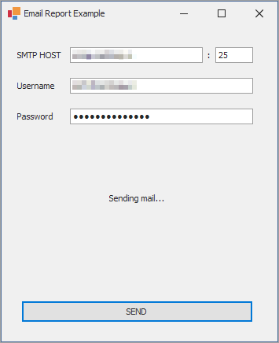

# How to Email a Report as a Document in PDF 

This example demonstrates how to send a report by e-mail. Enter the SMTP host, port, smtp credentials, and click Send to email a document to the address specified in the report export options. 

To email a report as a PDF attachment, do the following:

* Call the [XtraReport.ExportToPdf](https://docs.devexpress.com/XtraReports/DevExpress.XtraReports.UI.XtraReport.ExportToPdf.overloads) method to export a report to a PDF document.
* Attach the PDF document to the [MailMessage](https://docs.microsoft.com/en-us/dotnet/api/system.net.mail.mailmessage) object.
* Retrieve the report's [ExportOptions.Email](https://docs.devexpress.com/CoreLibraries/DevExpress.XtraPrinting.EmailOptions) settings and apply them to the MailMessage settings.
* Create the [SmtpClient](https://docs.microsoft.com/en-us/dotnet/api/system.net.mail.smtpclient) instance and call its [SendMailAsync](https://docs.microsoft.com/en-us/dotnet/api/system.net.mail.smtpclient.sendmailasync) method.

<!-- default file list -->

## Files to Look At

- [Form1.cs](CS/Form1.cs) ([Form1.vb](VB/Form1.vb))

<!-- default file list end -->

## Documentation

- [Email Reports](http://docs.devexpress.devx/XtraReports/17634/detailed-guide-to-devexpress-reporting/store-and-distribute-reports/export-reports/email-reports)

## More Examples

- [How to Send a Report as HTML in an Email Body](https://github.com/DevExpress-Examples/Reporting_how-to-send-a-report-as-html-in-an-email-body-t314020)
- [Web Document Viewer - How to send a report via Email from the client side](https://github.com/DevExpress-Examples/Reporting_web-document-viewer-how-to-send-a-report-via-email-from-the-client-side-t566760)